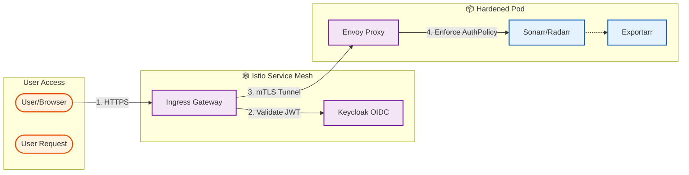

# 🎬 Media Automation Stack (*ARR)

## Executive Summary
This specific project module implements the **Complete Media Automation Workload** (Plex, Sonarr, Radarr, Lidarr, Readarr, Prowlarr, SABnzbd, Overseerr) on top of the High-Assurance K3s Cluster. It is designed to be a **Reference Implementation** for running legacy/monolithic applications in a **Zero Trust** and **NIST 800-53 Compliant** environment.

---

## 1. System Architecture 🏗️

The stack runs within the `media` namespace, fully integrated with the platform's Service Mesh (Istio) and Identity Provider (Keycloak).

### 1.1 Secure Traffic Flow (Zero Trust Overlay)

Every request to the media stack undergoes strict verification before reaching the application.



### 1.2 Storage Architecture (Tiered)

| Volume | Type | Tier | Purpose |
| :--- | :--- | :--- | :--- |
| **/config** | **PVC (RWO)** | **Hot (NVMe)** | SQLite databases, UI configuration, extensive random I/O. |
| **/media** | **PVC (RWX)** | **Capacity (RAID)** | Shared library for massive video files. Written by SABnzbd, Read by Media Server. |
| **/transcode**| **emptyDir** | **RAM (/dev/shm)** | Temporary transcoded chunks (Plex only). |

---

## 2. NIST 800-53 Compliance Matrix 🛡️

This deployment explicitly implements the following controls to meet **High-Assurance** standards.

| NIST ID | Control Family | implementation Detail | Technical Enforcement |
| :--- | :--- | :--- | :--- |
| **AC-6** | **Least Privilege** | **Non-Root Execution** | `runAsNonRoot: true`, `RunAsUser: 1000`. |
| **AC-6(1)** | **Privileged Access** | **Drop Capabilities** | `capabilities: drop: ["ALL"]` prevents root escalation. |
| **SC-7** | **Boundary Protection** | **Network Isolation** | `NetworkPolicy` denies all ingress/egress by default. |
| **SC-8** | **Transmission Integrity** | **mTLS** | Strict mTLS enforced by Istio between all components. |
| **SI-7** | **Software Integrity** | **Immutable Root** | `readOnlyRootFilesystem: true` prevents runtime binary modification. |
| **IA-2** | **Identification** | **OIDC Enforcement** | `RequestAuthentication` validates Keycloak JWTs at the pod boundary. |

---

## 3. Hardening & Security Implementation 🔒

### 3.1 Network Defense-in-Depth
We utilize a defense-in-depth strategy combining Layer 3/4 (CNI) and Layer 7 (Mesh) protections.

*   **Layer 3 (Calico/Cilium)**: A **Default-Deny** `NetworkPolicy` blocks all lateral movement.
    *   *Allow:* DNS (UDP 53)
    *   *Allow:* Istio Control Plane
    *   *Allow:* Ingress Gateway
*   **Layer 7 (Istio)**: An `AuthorizationPolicy` requires a valid `requestPrincipal` (JWT) for all HTTP traffic.

### 3.2 Container Hardening
Applications are sandboxed to prevent breakout attacks.

```yaml
securityContext:
  allowPrivilegeEscalation: false
  readOnlyRootFilesystem: true
  capabilities:
    drop: ["ALL"]
  seccompProfile:
    type: RuntimeDefault
```

---

## 4. Observability & Metrics 🔭

To support the **Grafana LGTM** stack, legacy applications are augmented with sidecars.

### 4.1 Exportarr Integration
Each pod runs an `exportarr` sidecar to translate application APIs into **Prometheus Metrics**.
*   **Port:** `9794`
*   **Auth Bypass:** Explicitly allowed in `AuthorizationPolicy` for the OpenTelemetry Collector.

### 4.2 Available Metrics
*   `sonarr_queue_total`: Current download queue size.
*   `sonarr_series_total`: Total managed series.
*   `prowlarr_indexer_status`: Health of configured indexers.

---


## 5. Catalog 📚

| Application | Function | Hardware Accel | Static IP (MetalLB) |
| :--- | :--- | :--- | :--- |
| **Plex** | Media Server | **Nvidia GPU** (Transcode) | `<STATIC-IP-1>` |
| **Sonarr** | TV Shows | N/A | `<STATIC-IP-2>` |
| **Radarr** | Movies | N/A | `<STATIC-IP-3>` |
| **Lidarr** | Music | N/A | `<STATIC-IP-4>` |
| **Readarr** | Books | N/A | `<STATIC-IP-5>` |
| **Bazarr** | Subtitles | N/A | `<STATIC-IP-6>` |
| **Prowlarr** | Indexer | N/A | `<STATIC-IP-7>` |
| **SABnzbd** | Downloader | N/A | `<STATIC-IP-8>` |
| **Overseerr**| Requests | N/A | `<STATIC-IP-9>` |
| **Tautulli** | Monitoring | N/A | `<STATIC-IP-10>` |
| **Recyclarr**| Sync Job | N/A | N/A |

---

## 6. Remote Access Strategy (NIST IA-8) 🌍

**Method:** **Tailscale VPN + Istio**

To minimize the attack surface, we do **not** expose services directly to the public internet (no port forwarding).
1.  **Transport**: WireGuard tunnel via Tailscale.
2.  **Authentication**: Tailscale Identity (MFA/SSO).
3.  **Routing**:
    *   **User** connects to Tailscale.
    *   **User** accesses `*.bavsworld.com` (configured via local DNS or hosts file pointing to Istio Gateway VIP).
    *   **Traffic** flows: `VPN -> MetalLB -> Istio Gateway -> AuthPolicy -> Pod`.

---

## 7. CI/CD & Validation 🚀

We treat Infrastructure as Code (IaC) with the same rigor as application code.

### 7.1 Pipeline Structure
*   **Workflow**: [`.github/workflows/ci.yaml`](.github/workflows/ci.yaml)
*   **Triggers**: Push/PR to `main`.
*   **Checks**:
    1.  **YAML Linting**: Enforces consistent formatting using `yamllint`.
    2.  **Kustomize Build**: Ensures all patches and overlays merge correctly.
    3.  **Schema Validation**: Uses `kubeconform` to verify strict Kubernetes API compliance (catch typos, wrong types).
    4.  **Security Scan**: Uses `Trivy` to scan for IaC misconfigurations and vulnerabilities.

### 7.2 Validation Tools
*   **Run Check (Local)**: `./scripts/validate-manifests.sh`
*   **Monitor CI (Remote)**: `./scripts/monitor-ci.ps1`

---

## 8. Configuration as Code 🏗️

We have codified the configuration and integration of the stack to minimize manual click-ops.

### 8.1 Recyclarr (Quality Profiles)
Recyclarr syncs quality definitions (TRaSH Guides) to Sonarr/Radarr.
*   **Config**: `kubernetes/apps/media/recyclarr/config.yaml` (Managed in Git).
*   **Secrets**: API Keys are injected via the `!env_var` feature using Kubernetes Secrets.
*   **Update**: Edit the ConfigMap, push to Git, and the CronJob runs daily (or manually trigger).

### 8.2 Integration Job (Auto-Linking)
Instead of manually adding Prowlarr to Sonarr, or Sonarr to SABnzbd:
*   **Job**: `kubernetes/apps/media/setup-job`
*   **Action**: Runs `configure.sh` which hits the APIs of the deployed services.
*   **Effect**: Automatically links Indexers (Prowlarr -> *Arrs) and Download Clients (*Arrs -> SABnzbd).
*   **Scope**: Supports Sonarr, Radarr, Lidarr, and Readarr.
*   **Run**: Applied automatically with Kustomize. Safe to re-run (Idempotent).

---

## 9. Day 2 Operations Guide 🛠️

### 9.1 Updating Applications
To update an application (e.g., Sonarr) to a new version:
1.  Edit `kubernetes/apps/media/sonarr/app.yaml`.
2.  Update the `image:` tag.
3.  Validate: `./scripts/validate-manifests.sh`.
4.  Apply: `kubectl apply -k kubernetes/apps/media/sonarr`.

### 9.2 Rotating Secrets (SOPS)
If an API key is compromised:
1.  Edit the encrypted secrets file:
    ```bash
    sops kubernetes/apps/media/secrets.sops.yaml
    ```
2.  Update the value (e.g., generate a new API key).
3.  Save and Exit (SOPS handles re-encryption).
4.  Apply to cluster:
    ```bash
    sops -d kubernetes/apps/media/secrets.sops.yaml | kubectl apply -f -
    ```
5.  Restart pods to pick up new keys.

### 9.3 Troubleshooting "CrashLoopBackOff"
*   **Check Logs**: `kubectl logs -n media sonarr-0 -c sonarr` (Check previous logs with `-p` if it crashed immediately).
*   **Check Permissions**: If `sqlite3 readonly` error, the `fsGroup: 1000` context might not be propagating to the NFS share. Verify the underlying storage permissions.

---

## 10. Getting Started 🚀

### 10.1 Deploy Secrets (SOPS)
Unlock the secrets using your Age key and apply them to the cluster.

```bash
sops -d kubernetes/apps/media/secrets.sops.yaml | kubectl apply -f -
```

### 10.2 Deploy Stack

#### Option A: Secure Deployment (Default)
**Requirement**: Keycloak and DNS are configured.
```bash
kubectl apply -k kubernetes/apps/media
```

#### Option B: Pre-Keycloak Deployment (No-Auth)
**Requirement**: None. Bypasses all authentication (Use only on trusted LAN).
```bash
kubectl apply -k kubernetes/apps/overlays/media-no-auth
```
This overlay strips out `AuthorizationPolicy` and `RequestAuthentication` resources, allowing you to access the Static IPs directly.

### 10.3 Deployment Breakdown
This will deploy:
1.  All Applications (StatefulSets) with Static IPs (`<STATIC-IP-1>+`).
2.  Network Polices & Istio Rules.
3.  Recyclarr (for config sync).
4.  Setup Job (for integration linking).

